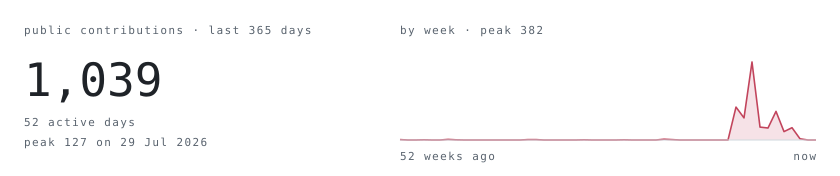
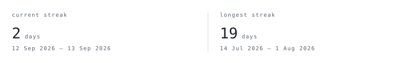
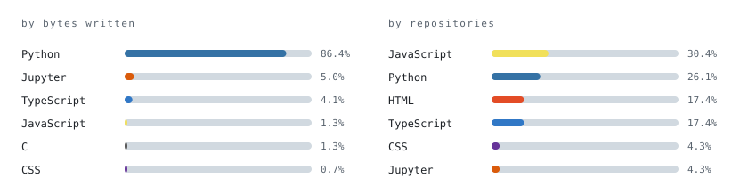
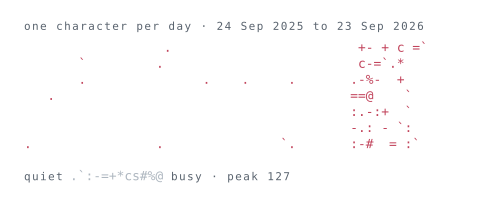

<picture>
  <source media="(prefers-color-scheme: dark)" srcset="assets/face-dark.svg">
  
</picture>

> B.Tech in Data Science &amp; Analytics at IIIT Nagpur, final year.
> I build AI knowledge systems — knowledge graphs, vector search and LLMs
> wired together so retrieval stays grounded in something real.

Everything below is drawn by <a href="scripts/">this repository</a> and
refreshed by <a href=".github/workflows/refresh-stats.yml">a scheduled
action</a>. No third-party image services, so nothing here can rate-limit,
restyle, or go dark.

**[Callosum](https://github.com/Cloverag/callosum)** — institutional memory 
An AI knowledge layer for grounded retrieval over organizational decisions. 
A Neo4j knowledge graph and pgvector semantic search answer together, so 
every answer carries a path back to the document it came from. 
<samp>Neo4j · pgvector · Python · Claude</samp> &nbsp;·&nbsp; final year project

**[Portfolio](https://github.com/Cloverag/portfolio)** — interactive site 
A developer portfolio with a live shader-gradient background and 3D scenes. 
<samp>Next.js · TypeScript · Three.js · Framer Motion</samp>

**[Offensive Security Scripts](https://github.com/Cloverag/offensive-security-scripts)** — recon toolkit 
A growing set of tools for recon and exploitation, written to understand 
the attack side well enough to defend my own infrastructure. 
<samp>Python</samp>

**[Pothole Detection System](https://github.com/Cloverag/Pothole-Detection-System)** — road damage CV 
Detecting road surface damage from camera input and serving the results. 
<samp>PyTorch · OpenCV · Flask · React</samp>

<samp>Python · TypeScript · C++ · SQL</samp> 
<samp>PyTorch · OpenCV · pandas · NumPy</samp> 
<samp>Next.js · React · Tailwind · Three.js</samp> 
<samp>Flask · Node · PostgreSQL · Neo4j · pgvector</samp> 
<samp>Docker · AWS · Linux · Git</samp>

These count public activity only — the same figures
<a href="https://github.com/users/Cloverag/contributions">GitHub serves to an
anonymous visitor</a> — so anyone can check them against the source.

[LinkedIn](https://linkedin.com/in/raghav-singh-11b82a290) &nbsp;·&nbsp;
[X](https://x.com/Raghav474782328) &nbsp;·&nbsp;
[Instagram](https://instagram.com/raghavvv_64)
